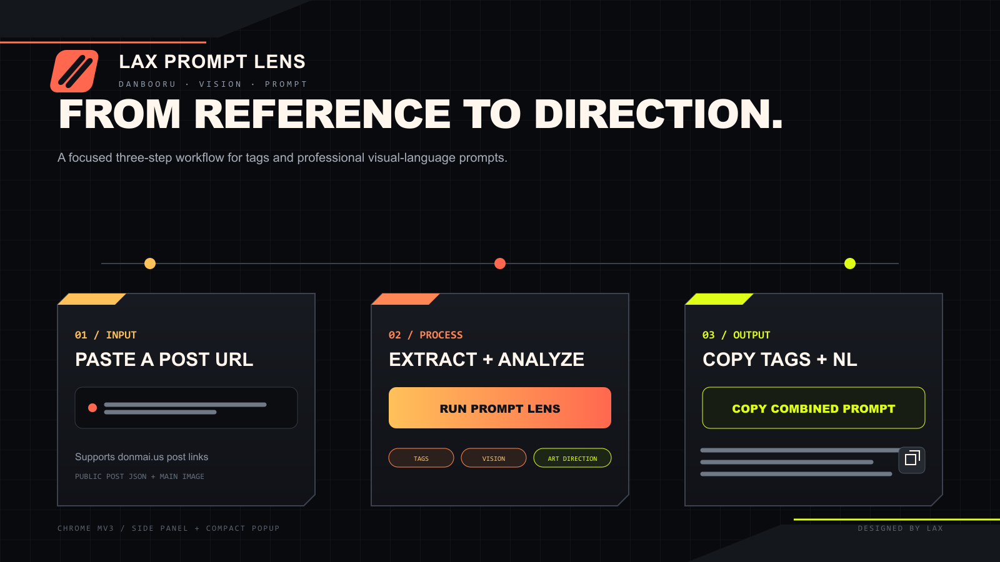

<div align="center">

# LAX Prompt Lens

**Turn a Danbooru reference into clean tags and professional visual art direction.**

[English](#english) · [中文](#中文)


</div>

---

## English

### Overview

LAX Prompt Lens is a local Chrome Manifest V3 extension for reference-image analysis. Paste a public Danbooru post URL and it will:

1. read the post's artist, copyright, character, general, and optional meta tags;
2. normalize the tags into image-generation-friendly text;
3. send the main image to a vision-capable API selected by the user;
4. produce a polished 300–550 word English art-direction prompt covering composition, camera, depth, drawing method, edge control, color, lighting, materials, and editorial character;
5. return the Tags Prompt, Visual NL Prompt, and Combined Prompt separately.



### Highlights

- **Stable tag extraction** — reads Danbooru's public post JSON instead of scraping sidebar HTML.
- **Professional visual language** — prioritizes the face, silhouette, composition, depth, rendering method, color hierarchy, and lighting logic instead of listing every visible object.
- **Descriptive output** — normalizes accidental imperative openings such as `Create ...` into a coherent `A ...` / `An ...` image prompt.
- **Two interface modes** — a full Chrome Side Panel and a compact toolbar popup.
- **Provider flexibility** — presets for JarlessAPI Responses and the official OpenAI API, plus an optional compatible custom endpoint.
- **Local-first key handling** — the API key is session-only by default and is saved locally only when the user explicitly enables it.
- **Stateless requests** — Responses requests use `store: false`.

### Install from source

1. Download or clone this repository.
2. Open `chrome://extensions` in Chrome.
3. Enable **Developer mode**.
4. Click **Load unpacked**.
5. Select the repository root containing `manifest.json`.
6. Pin **LAX Prompt Lens** to the toolbar.

### Use

1. Paste a URL such as `https://shima.donmai.us/posts/11647422?...`.
2. Choose **Tags only** if you do not need AI analysis.
3. For the complete workflow, open **Vision API Settings**, choose a provider, and enter your own API key.
4. Click **Extract & Analyze**.
5. Copy the Tags Prompt, Visual NL Prompt, or Combined Prompt.

### Compact mode

Use **Compact mode** from the full panel to switch the toolbar action into a small popup. It keeps only the URL field, generate action, combined-copy button, and a link back to the full panel. Current settings and session results are shared between both modes.

### Default API preset

| Setting | Default |
| --- | --- |
| Provider | JarlessAPI Responses |
| Base URL | `https://jarlessapi.com` |
| Model | `gpt-5.6-luna` |
| Reasoning effort | `xhigh` |
| Response storage | disabled (`store: false`) |
| Image source | Danbooru sample image when available |

The extension also supports the official OpenAI Responses API and compatible custom endpoints. Every user must provide their own API key; no key is included in this repository.

### Tag formatting

The default order is:

```text
artist → copyright → character → general
```

Underscores become spaces, and parentheses are escaped as `\(` and `\)`. Meta tags are excluded by default because many describe file properties rather than the visual subject.

### Privacy and security

- The extension reads only the public Danbooru post selected by the user.
- The selected post image and analysis instruction are sent to the API endpoint configured by the user.
- API keys are sent only to that configured endpoint.
- Keys are not persisted unless **Save key locally** is enabled.
- The extension does not vote, favorite, edit, or upload Danbooru content.
- Signing keys, packaged CRX files, environment files, and local credentials are excluded from version control.

### Development

No third-party npm package is required for the test suite.

```powershell
node --test
```

Current test coverage includes URL parsing, API fallbacks, category ordering, tag formatting, endpoint resolution, Responses payload construction, prompt policy, and output normalization.

### Known limitations

- Deleted, restricted, or account-gated posts may not be readable.
- GIF or video posts may fall back to a static preview image.
- Visual-model output is non-deterministic and should still be reviewed by an artist.
- Browser-side key storage is intended for personal use. Team distribution should use a backend proxy with server-side secret management, quotas, and auditing.

### Disclaimer

LAX Prompt Lens is an independent tool and is not affiliated with Danbooru, JarlessAPI, or OpenAI. Respect source-site terms, artist rights, and the policies of your selected model provider.

---

## 中文

### 项目简介

LAX Prompt Lens 是一款本地运行的 Chrome Manifest V3 参考图分析扩展。粘贴公开的 Danbooru 帖子链接后，它会：

1. 读取 artist、copyright、character、general 以及可选的 meta tags；
2. 将标签整理为适合图像生成的文本格式；
3. 把帖子主图发送到使用者选择的视觉 API；
4. 生成约 300–550 词的英文专业美术指导 Prompt，重点分析构图、镜头、空间层次、绘制方法、边缘控制、色彩、光照、材质与编辑美学；
5. 分别输出 Tags Prompt、Visual NL Prompt 和 Combined Prompt。

### 核心特点

- **稳定提取标签**：读取 Danbooru 公开帖子 JSON，而不是抓取网页侧栏 DOM。
- **专业画面分析**：优先关注面部、轮廓、构图、空间、绘制技法、色彩层级和光照逻辑，不机械枚举全部物体。
- **描述式输出**：自动把模型偶发返回的 `Create ...` 命令式开头整理为连贯的 `A ...` / `An ...` 图像提示词。
- **两种界面模式**：提供完整 Chrome 侧边栏和紧凑工具栏小窗。
- **多服务支持**：内置 JarlessAPI Responses、OpenAI 官方 API 预设，并可选兼容自定义接口。
- **本地优先的 Key 管理**：API Key 默认只在当前会话使用；仅在使用者主动勾选后保存到本机。
- **无状态请求**：Responses 请求设置 `store: false`。

### 从源码安装

1. 下载或克隆本仓库。
2. 在 Chrome 打开 `chrome://extensions`。
3. 开启右上角的**开发者模式**。
4. 点击**加载已解压的扩展程序**。
5. 选择包含 `manifest.json` 的仓库根目录。
6. 将 **LAX Prompt Lens** 固定到工具栏。

### 使用方法

1. 粘贴形如 `https://shima.donmai.us/posts/11647422?...` 的帖子链接。
2. 如果不需要 AI 画面分析，点击**只提取标签**。
3. 如需完整流程，展开**视觉 API 设置**，选择服务并填写自己的 API Key。
4. 点击**提取并分析**。
5. 复制 Tags Prompt、Visual NL Prompt 或 Combined Prompt。

### 小窗模式

在完整版顶部点击**小窗模式**，工具栏按钮会切换为紧凑弹窗。小窗只保留帖子 URL、生成按钮、组合结果复制按钮和返回完整版入口；设置与本次会话结果会在两个模式之间共享。

### 默认 API 预设

| 设置 | 默认值 |
| --- | --- |
| 服务 | JarlessAPI Responses |
| Base URL | `https://jarlessapi.com` |
| 模型 | `gpt-5.6-luna` |
| Reasoning effort | `xhigh` |
| 响应留存 | 关闭（`store: false`） |
| 图片来源 | 优先使用 Danbooru sample 图 |

扩展同样支持 OpenAI 官方 Responses API 与兼容的自定义接口。每位使用者都需要填写自己的 API Key；本仓库不包含任何 Key。

### 标签格式

默认顺序为：

```text
artist → copyright → character → general
```

下划线会转换为空格，括号会转义为 `\(` 与 `\)`。Meta tags 默认不加入，因为其中很多内容描述的是文件属性而非画面主体。

### 隐私与安全

- 扩展只读取使用者主动选择的公开 Danbooru 帖子。
- 帖子图片与分析指令会发送到使用者配置的 API Endpoint。
- API Key 只会发送到该 Endpoint。
- 除非主动开启**在本机保存 Key**，否则 Key 不会持久化。
- 扩展不会修改、收藏、评分或上传 Danbooru 内容。
- 签名私钥、CRX、环境配置与本地凭据均已从版本控制中排除。

### 开发与测试

测试不依赖第三方 npm 包：

```powershell
node --test
```

当前测试覆盖 URL 解析、API 回退、分类顺序、标签格式、Endpoint 解析、Responses 请求体、提示词约束与输出规范化。

### 已知限制

- 删除、受限或需要账号权限的帖子可能无法读取。
- GIF 或视频帖子可能只能使用静态预览图分析。
- 视觉模型输出具有非确定性，仍建议由美术人员复核。
- 浏览器端保存 Key 适合个人使用；团队分发建议使用后端代理，在服务端管理密钥、额度与审计。

### 声明

LAX Prompt Lens 是独立工具，与 Danbooru、JarlessAPI 或 OpenAI 均无隶属或合作关系。请遵守来源网站条款、创作者权益及所选模型服务商的政策。
